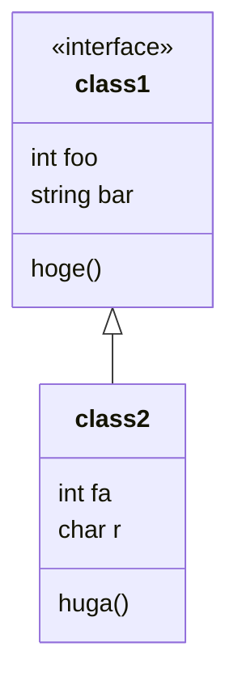

# クラス図の確認

```mermaid 
  classDiagram 
    class class1{
        <<interface>>        
        int foo
        string bar

        hoge()
    }

    class class2{
        int fa
        char r

        huga()
    }
    class1<|--class2
```