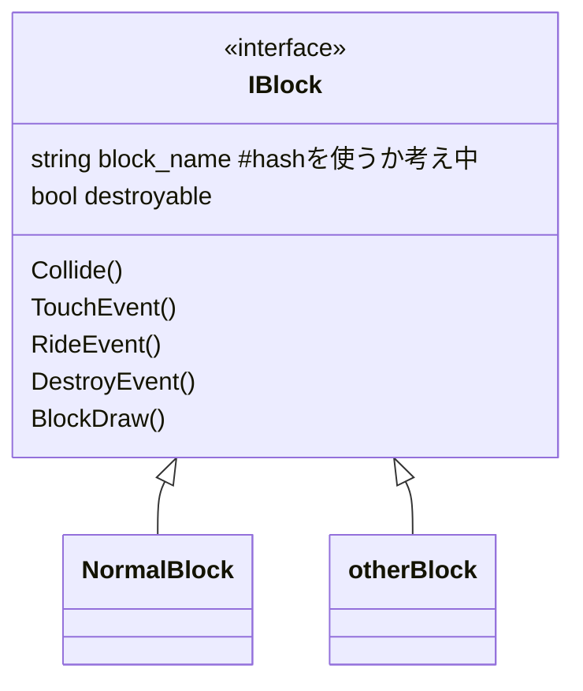
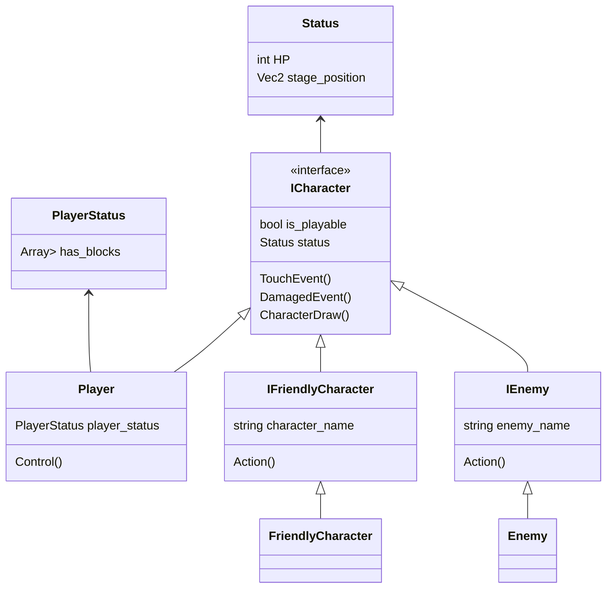
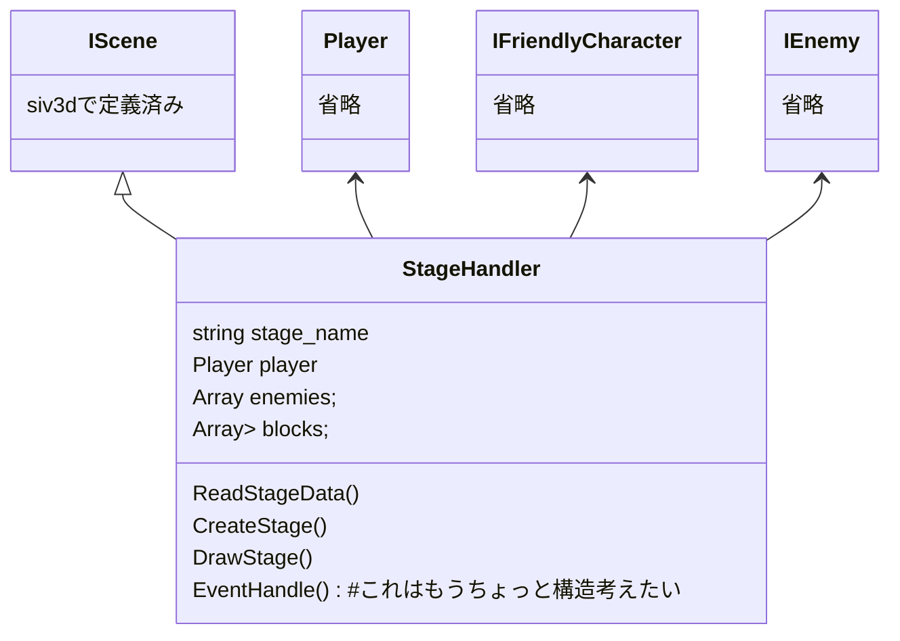

# クラス図の確認

ブロック

```mermaid 
classDiagram

class IBlock{
    <<interface>>
    string block_name #hashを使うか考え中
    bool destroyable

    Collide()
    TouchEvent()
    RideEvent()
    DestroyEvent()

    BlockDraw()
    
}

class NormalBlock{
    
}
IBlock<|--NormalBlock
IBlock<|--otherBlock

```

キャラクター

```mermaid
classDiagram

class Status {
    int HP 
    Vec2 stage_position
}

class ICharacter {
    <<interface>>

    bool is_playable
    Status status

    TouchEvent()
    DamagedEvent()

    CharacterDraw()
}

class PlayerStatus {
    Array<Pair<IBlock, int>> has_blocks
}

class Player {
    PlayerStatus player_status
    Control()

}

class IFriendlyCharacter {
    string character_name
    Action()
}

class FriendlyCharacter {
    
}

class IEnemy {
    string enemy_name
    Action()
}

class Enemy {
    
}

Status<--ICharacter
ICharacter<|--Player
PlayerStatus<--Player
ICharacter<|--IFriendlyCharacter
IFriendlyCharacter<|--FriendlyCharacter
ICharacter<|--IEnemy
IEnemy<|--Enemy


```

ステージ管理

```mermaid
classDiagram

class Player {
    省略
}

class IFriendlyCharacter{
    省略
}

class IEnemy {
    省略
}

class StageHandler {
    string stage_name

    Player player
    Array<IEnemy> enemies;
    Array<Array<IBlock>> blocks; 

    ReadStageData()
    CreateStage()
    DrawStage()

    EventHandle() #これはもうちょっと構造考えたい
}

class IScene {
    siv3dで定義済み
}

IScene<|--StageHandler
Player<--StageHandler
IFriendlyCharacter<--StageHandler
IEnemy<--StageHandler

```

## メモ

ステージ名とかをハッシュにすると検索が高速になるからそっちに置き換えを検討
